# ML-SDM2026
This repository contains datasets and scripts for reproducing the analyses and figures presented in:

"Evolution of machine learning-based species distribution models: technological development, research trends, and future challenges"

[](https://www.r-project.org/)
[](https://posit.co/download/rstudio-desktop/)
[](https://www.python.org/)
[](https://www.bibliometrix.org/)
[](https://www.vosviewer.com/)
[](https://www.histcite.com/)

------------------------------------------------------------------------------

## Abstract
Species distribution models (SDM) have become important tools for biodiversity assessment, ecological prediction, and conservation planning. Recent advances in machine learning (ML) have greatly expanded the capability of SDM to analyze complex ecological data. However, the overall development trajectory, knowledge structure, and methodological implications of machine learning-based SDM (ML-SDM) remain insufficiently synthesized. This study provides a comprehensive review of ML-SDM research from 2006 to 2025 by integrating bibliometric analysis with methodological synthesis. Using 5,224 articles retrieved from the Web of Science Core Collection, we combined general bibliometric statistics, collaboration analysis, co-citation analysis, bibliographic coupling, temporal keyword evolution, and qualitative synthesis to investigate research trends, methodological development, knowledge accumulation, and future challenges. The results reveal that ML-SDM has undergone a methodological evolution rather than a simple transition from traditional ML to deep learning (DL). Early studies established the methodological foundation through MaxEnt, Random Forest, and other ML algorithms, followed by advances in model evaluation, uncertainty assessment, and ecological applicability. Recent developments increasingly emphasize DL, ensemble modelling, remote sensing, and multi-source environmental data, reflecting an expansion from improving predictive accuracy toward modelling increasingly complex ecological information. The observed development and global dissemination patterns of ML-SDM are associated with broader ecological demands, technological advances, expanding environmental data resources, and increasing international collaboration, which may have provided enabling conditions for methodological innovation and knowledge exchange. Co-citation and bibliographic coupling analyses further suggest that methodological development has progressed through successive efforts to address key modelling challenges. Although DL-SDM expands the capacity of ML-SDM to analyse high-dimensional and spatially structured ecological data, it remains primarily a correlative modelling framework and does not replace traditional ML approaches. Challenges related to ecological interpretation, uncertainty assessment, spatial transferability, and model transparency continue to limit its practical application.

## Workflow

The overall workflow of this study is shown below.

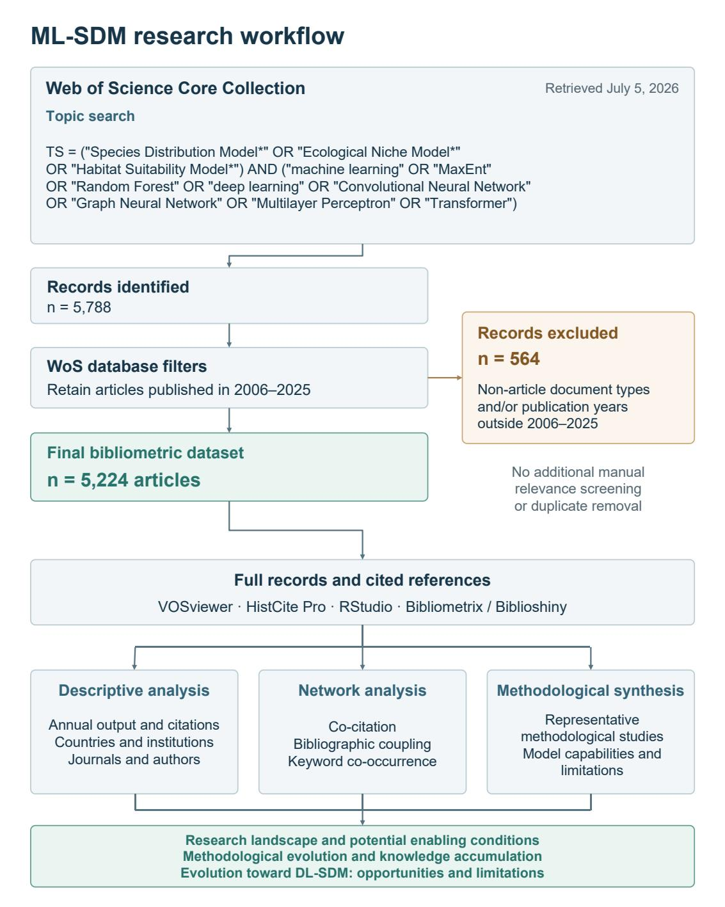

-------------------------------------------------------------------------------------------

## Dataset

Literature data were retrieved from Web of Science Core Collection.

Search period:2006-2025

Document type:Article

Search strategy:

    TS = ("Species Distribution Model*" OR "Ecological Niche Model*" OR "Habitat Suitability Model*") AND ("machine learning" OR "MaxEnt" OR "Random Forest" OR "deep learning" OR "Convolutional Neural Network" OR "Graph Neural Network" OR "Multilayer Perceptron" OR "Transformer")

Web of Science records：``` data/WoS_raw_records/ 06-10.txt... ```

### Processed datasets

The processed datasets were generated from the Web of Science Core Collection records using Bibliometrix, HistCite, VOSviewer, and customized Python/R scripts. Each dataset was prepared for specific bibliometric analyses and figure generation.

#### Dataset were exported from the HistCite Pro (version 2.1)

- `yearlyOutput.xlsx`  
  Used for generating: Figures/3.1.png

- `Author_TGCS.csv`  
  Used for generating: Figures/3.5.2.pn

- `Institution_Res.csv`  
  Used for generating: Table 3: Top ten institutions by publications, TLCS, and TGCS

- `Journal_TGCS.csv`  
  Used for generating: Table 4: Top Twenty Journals by TGCS
  
- `Table5_annual_top5_raw_TGCS_TLCS_candidates.xlsx`  
  Used to document the year-stratified candidate identification procedure for Table 5. For each publication year, the five studies with the highest TGCS and the five studies with the highest TLCS were identified separately. Studies appearing in both annual top-five lists were prioritized. If fewer than five studies overlapped, the remaining candidates were selected alternately from the TGCS and TLCS rankings until five unique studies were retained. The workbook contains the annual rankings, citation values, candidate-selection basis, and detailed selection rules. TGCS and TLCS were used only for reproducible candidate identification and not as direct measures of research quality or methodological importance.

#### Dataset were exported from the Biblioshiny interface of the Bibliometrix R package (version 5.2.1)

- `Most_Relevant_Countries.csv`  
  Used for generating: Figures/3.2.1.png and Figures/A.12.png

- `Author_Prod_over_Time_bibliometrix.xlsx`  
  Used for generating: Figures/3.5.2.png

- `paperMessage.xlsx`  
  Used as the main input dataset for keyword_year_merged.csv

#### Dataset were generated using Python scripts (version 3.10)

- `country_coauthorship_FINAL.csv`
 Used for generating: Figures/3.2.1.png

        Input: data/WoS_raw_records/V06-25(5224).txt       
        
        Run : source("code_python/country_coauthorship.py")

- `keyword_year_merged.csv `
 Used for generating: Figures/3.9.2.png

        Input: data/Processed/paperMassage.xlsx      
        
        Run : source("code_python/keyword_year.py")

----------------------------------------------------------------------------------------

## Reproducing the figures by RStudio (version 2026.01.0)
### Requirements

Install the required R packages before running the scripts.

```r
install.packages(c(
  "tidyverse",
  "ggrepel",
  "viridis",
  "RColorBrewer",
  "scales",
  "readxl",
  "readr",
  "sf",
  "rnaturalearth",
  "dplyr",
  "ggplot2",
  "cartogram",
  "countrycode",
  "RColorBrewer",
  "bibliometrix"
))
```

#### (1) 3.1.png：Temporal evolution of ML-SDM research from 2006 to 2025
Input ： 

    data/Processed/
    
    └── yearlyOutput.xlsx

Run : ``` source("code/R/Figure2_temporal_trend.R") ```

Output : ``` Figures/3.1.png ```

This figure illustrates the annual publication output, Total Global Citation Score (TGCS), and Total Local Citation Score (TLCS) from 2006 to 2025.

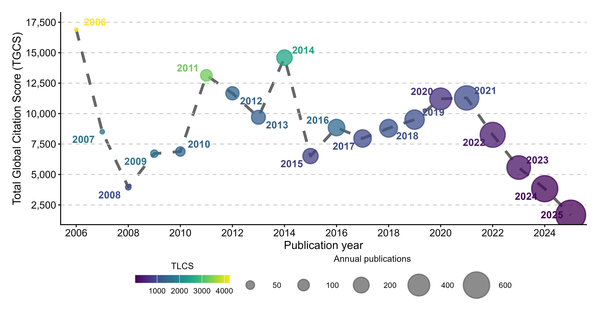

#### (2) 3.2.1.png：global distribution of publications and international collaboration networks in ML-SDM research
Input : 

    data/Processed/

    ├── country_coauthorship_FINAL.csv
    
    └── Most_Relevant_Countries.csv

Run : ``` source("code/R/international.R") ```

Output : ``` Figures/3.2.1.png ```
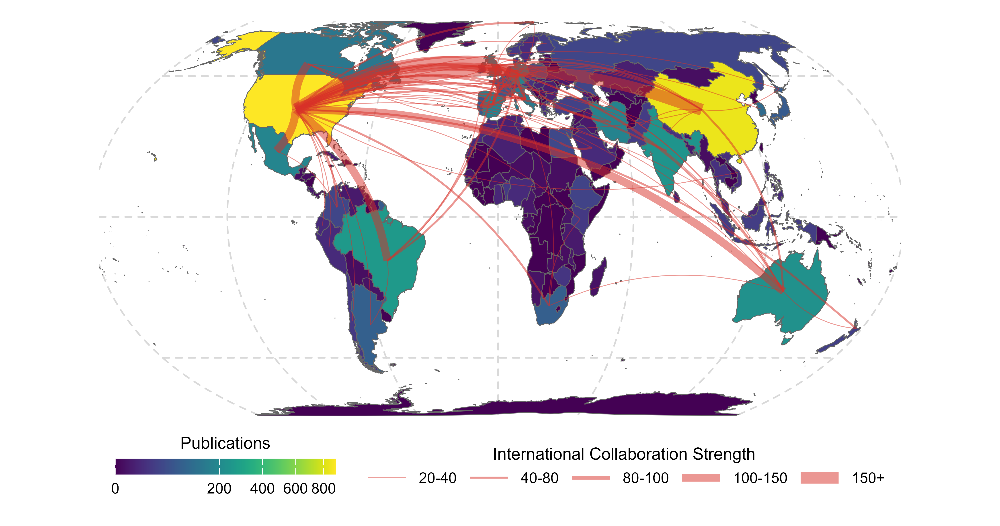

#### (3) 3.5.1.png: Top 10 Authors’ Publication Timeline Chart

Input :

    data/Processed/
    
    └── Author_Prod_over_Time_bibliometrix.xlsx

Run : ``` source("code/R/Author_production_overtime.R") ```

Output : ``` Figures/3.5.1.png ```

This figure illustrates the annual publication activity of the top 10 most productive authors from 2006 to 2025. Bubble size represents the number of articles published in each year, and bubble color indicates the total citation count.

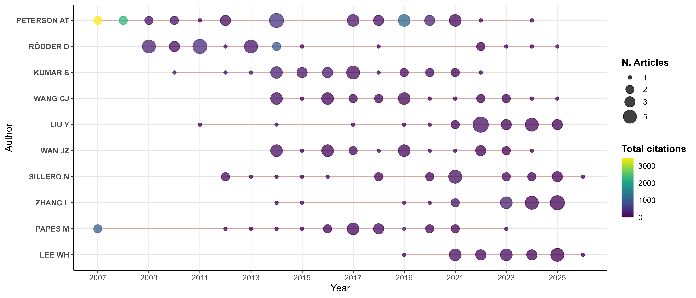

#### (4) 3.5.2.png:  Citation profiles of authors ranked in the top 20 by both TGCS and TLCS

Input :

    data/Processed/
    
    └── Author_TGCS.csv

Run : ``` source("code/R/Author_tgcs_tlcs.R") ```

Output : ``` Figures/3.5.2.png ```

This figure presents the citation profiles of authors who ranked simultaneously among the top 20 authors by TGCS and the top 20 authors by TLCS. TGCS is shown on the x-axis, TLCS is shown on the y-axis, and bubble size represents the number of publications. TGCS and TLCS are presented as separate descriptive measures of citation activity and scholarly visibility. No composite citation-impact index was calculated, and these indicators should not be interpreted as direct measures of research quality or methodological importance.

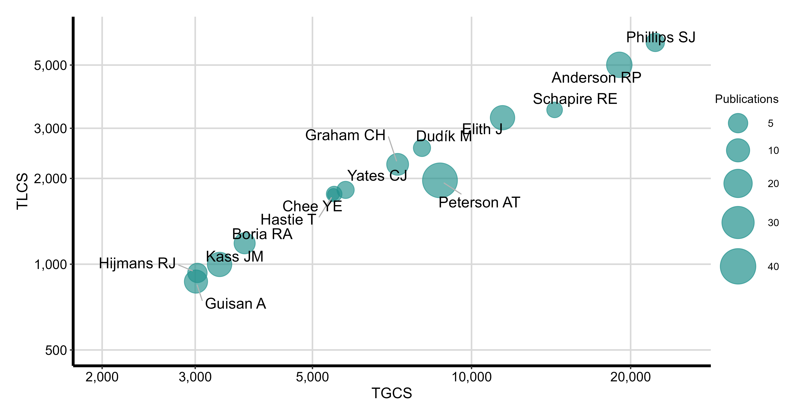

#### (5) 3.9.2.png: Life cycle evolution of major keywords in ML-SDM research from 2006 to 2025
Input :

    data/Processed/
    
    └── keyword_year_merged.csv

Run : ``` source("code/R/keywordsLife.R") ```

Output : ``` Figures/3.9.2.png ```

This figure illustrates the temporal evolution of 20 representative author keywords from 2006 to 2025. Bubble size represents the annual occurrence frequency of each keyword, while bubble color indicates the publication year.

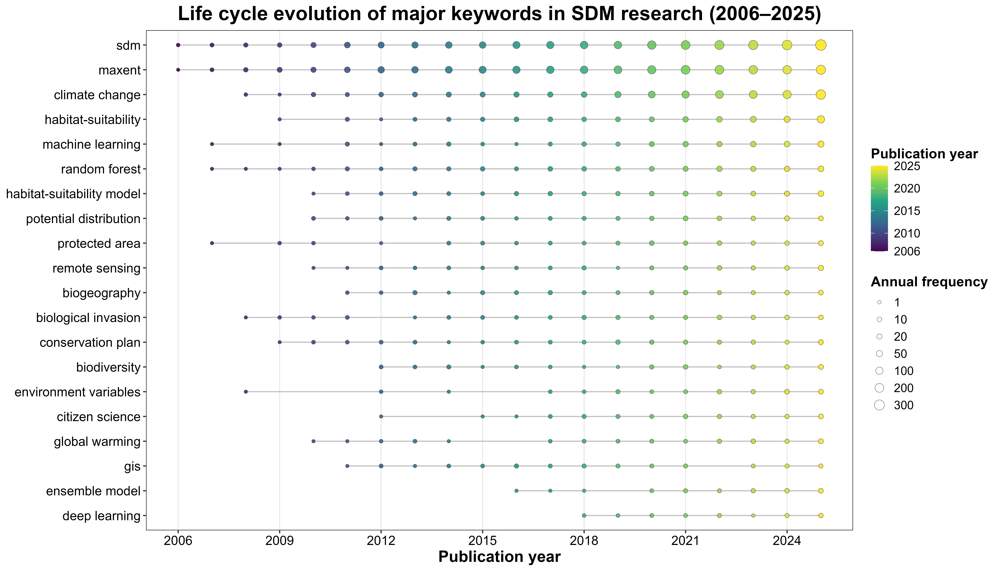

#### (6) Appendix_1.png: Country-level distribution of SCP and MCP in ML-SDM research

Input :

    data/Processed/
    
    └── Most_Relevant_Countries.csv

Run : ``` source("code/R/MCP_SCP.R") ```

Output : ``` Figures/Appendix_1.png ```

This figure illustrates the country-level distribution of single-country publications (SCP) and multiple-country publications (MCP) among the top 20 countries in ML-SDM research. The stacked bars represent publication contributions from domestic and international collaborations.

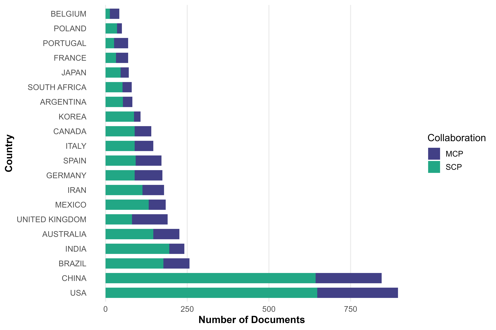

#### (7) 3.6.1.png & 3.6.2.png: Three-field collaboration plots of countries, authors, institutions, and journals

Input :

``` data/Processed/WoS_raw_records/V06-25(5224).txt ```

Run :
```r
library('bibliometrix')
biblioshiny()
```
Settings:

    Analysis:Three-Field Plot

        Left Field: Countries (AU_CO)  Number of Items: 10

        Middle Field: Authors (AU)  Number of Items: 10

        Right Field: Affiliations (AU_UN)  Number of Items: 10

Output: Figures/3.6.1.png

Settings:

    Analysis:Three-Field Plot

        Left Field: Countries (AU_CO)  Number of Items: 10

        Middle Field: Authors (AU)  Number of Items: 10

        Right Field: Sources (SO)  Number of Items: 10

Output: Figures/3.6.2.png

This figure illustrates the relationships among countries, authors, institutions, and journals in ML-SDM research using three-field plots generated by the Biblioshiny interface of the Bibliometrix package.

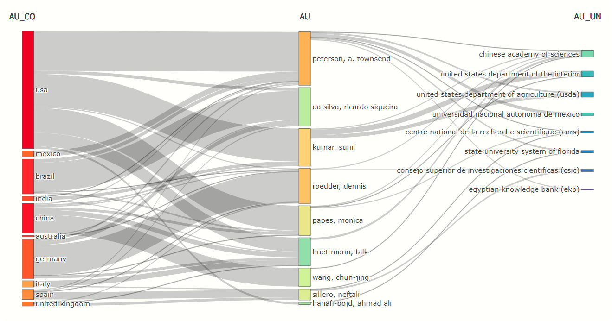

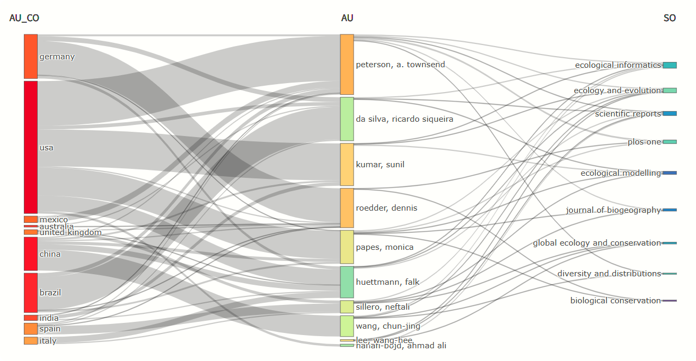

------------------------------------------------------------------------------------------------------
## Reproducing the figures by VoSViewer (version 1.6.20)

#### (1) 3.7.png: Co-citation network of cited references generated using VoSViewer

Input :

    data/WoS_raw_records/V06-25(5224).txt

Settings:

    Type of analysis: Co-citation

    Unit of analysis: Cited references

    Counting method: Full counting

    Minimum number of citations of a cited reference: 50

    Total number of cited references: 183,519

    Number of cited references meeting the threshold: 401

    Selection: 300 references with the highest total link strength

    Normalization: Association strength

    Clustering algorithm: VOSviewer clustering algorithm

    Resolution parameter: 1.00

    Minimum cluster size: 1

    Visualization: Network visualization

Each node represents a cited reference, and node size indicates the citation count of the reference. Links represent co-citation relationships, with stronger links indicating more frequent co-citation. Node colors represent clusters identified from the co-citation structure.​ The revised network uses a minimum citation threshold of 50 rather than the threshold of 30 used in the previous version. After applying the threshold, 401 cited references remained eligible, and the 300 references with the highest total link strength were retained for visualization.

Reproducibility files: 

    VOSviewer\cocitation\map_300(1).txt
    
    VOSviewer\cocitation\link_300(1).txt
    
These files can be loaded directly into VOSviewer to reproduce the network structure and visualization.

Output : ``` Figures/3.7.png ```

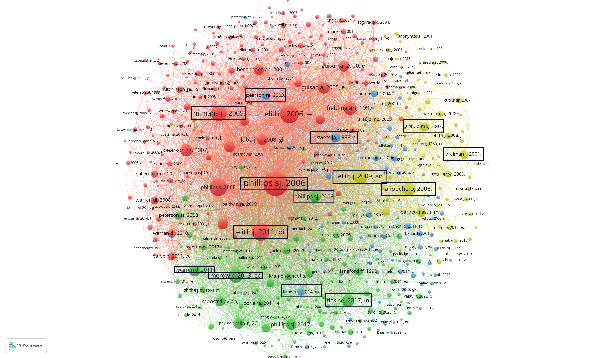

#### (2) 3.8.png: Bibliographical coupling network using VoSViewer

Input :

    data/WoS_raw_records/V06-25(5224).txt

DL-oriented search strategy:​
    
    ("Species Distribution Model*" OR "Ecological Niche Model*" OR "Habitat Suitability Model*")
    AND ("deep learning" OR "Convolutional Neural Network" OR "Graph Neural Network" OR "Multilayer Perceptron" OR "Transformer")

Settings:

    Type of analysis: Bibliographic coupling

    Unit of analysis: Documents

    Counting method: Full counting

    Minimum citation-count threshold: None

    Initial eligible publications: 5,224

    Core-document selection:
    300 documents with the highest total link strength

    Additional DL-related subset:
    61 articles identified using the predefined DL-oriented search strategy

    Final focused network:
    361 publications

    Normalization/layout: LinLog/modularity

    Clustering algorithm: VOSviewer clustering algorithm

    Resolution parameter: 1.00

    Minimum cluster size: 1

    Visualization: Overlay visualization

    Overlay variable: Publication year

The revised bibliographic coupling network does not apply a minimum citation-count threshold. All 5,224 publications were initially eligible. The 300 documents with the highest total link strength were retained to represent the strongly connected core of the overall ML-SDM literature. All 61 DL-related articles identified using the predefined DL-oriented search strategy were additionally retained to ensure representation of recent DL-SDM research. The final focused network therefore contains 361 publications.​
Each node represents a publication. Node size indicates citation count, links represent bibliographic coupling relationships based on shared references, and node color represents publication year, ranging from earlier publications in blue to more recent publications in yellow.

Reproducibility files:

    VOSviewer\bibliographic coupling\map.txt
    
    VOSviewer\bibliographic coupling\link.txt

Output: ``` Figures/3.8.png ```

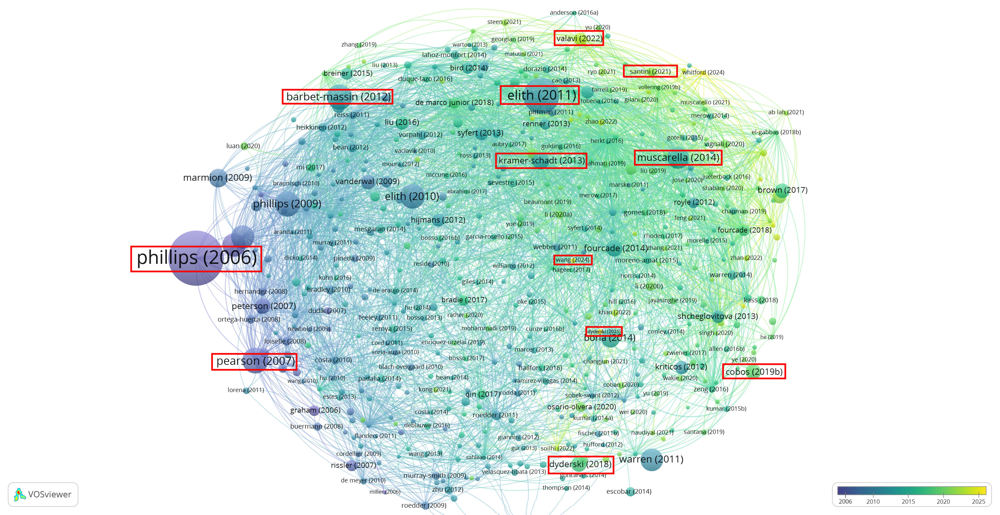


#### (3) 3.9.1.png: Co-word network of author keywords visualized using VoSViewer

Input :

    data/WoS_raw_records/
    ├── V06-25(5224).txt
    └── sameWord.txt

Search strategy:

    TS = ("Species Distribution Model*" OR "Ecological Niche Model*" OR "Habitat Suitability Model*") AND ("machine learning" OR "MaxEnt" OR "Random Forest" OR "deep learning" OR "Convolutional Neural Network" OR "Graph Neural Network" OR "Multilayer Perceptron" OR "Transformer")

Settings:

    Type of analysis: Co-occurrence 
    
    Unit of analysis: Author keywords 
    
    Counting method: Full counting 
    
    Thesaurus file: data/WoS_raw_records/sameWord.txt 
    
    Original number of author keywords: 11,273 
    
    Minimum number of occurrences of a keyword: 5 
    
    Number of keywords meeting the threshold: 643 
    
    Selection: 500 most relevant keywords 
    
    Visualization: Overlay visualization 
    
    Overlay variable: Average publication year

The co-word network was constructed from author keywords assigned to the 5,224 publications. After keyword standardization, only keywords occurring at least five times were retained. Of the 11,273 original author keywords, 643 met this threshold, and the 500 most relevant keywords were displayed to improve network readability. Each node represents an author keyword, and node size is proportional to occurrence frequency. Links indicate keyword co-occurrence within the same publication. Node color represents the average publication year of the keyword, ranging from blue for earlier studies to yellow for more recent studies.

Reproducibility files:

    VOSviewer\author keyword\ML-SDM_map.txt
    
    VOSviewer\author keyword\ML-SDM_link.txt

Output : ``` Figures/3.9.1.png ```

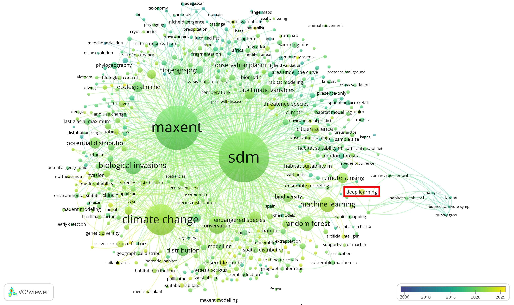

#### (4) Figure/3.9.3.png: Co-word network of keywords in DL-SDM research

Input :

    data/WoS_raw_records/
    ├── DL-SDM18-15.txt
    └── sameWord.txt

Search strategy:

    TS =("Species Distribution Model*" OR "Ecological Niche Model*" OR "Habitat Suitability Model*")AND("deep learning" OR "Convolutional Neural Network" OR "Graph Neural Network" OR "Multilayer Perceptron" OR "Transformer")

Settings:

    Type of analysis: Co-occurrence
    
    Unit of analysis: All Keywords
    
    Counting method: Full counting

    Thesaurus file: data/WoS_raw_records/sameWord.txt 

    Original number of author keywords: 486
    
    Minimum number of occurrences of a keyword: 2

    Number of keywords meeting the threshold: 76

    Selection: 76 most relevant keywords
    
    Visualization: Overlay Visualization

Reproducibility files:

    VOSviewer\author keyword\DL-SDM_map.txt
    
    VOSviewer\author keyword\DL-SDM_link.txt

Output : ``` Figures/3.9.3.png ```

This figure visualizes the co-word network of keywords in DL-SDM research. Nodes represent keywords, node size indicates occurrence frequency, links represent keyword co-occurrence relationships, and node colors indicate the average publication year of associated studies. The overlay visualization highlights the temporal evolution of research topics from earlier studies to recent developments in DL-SDM.

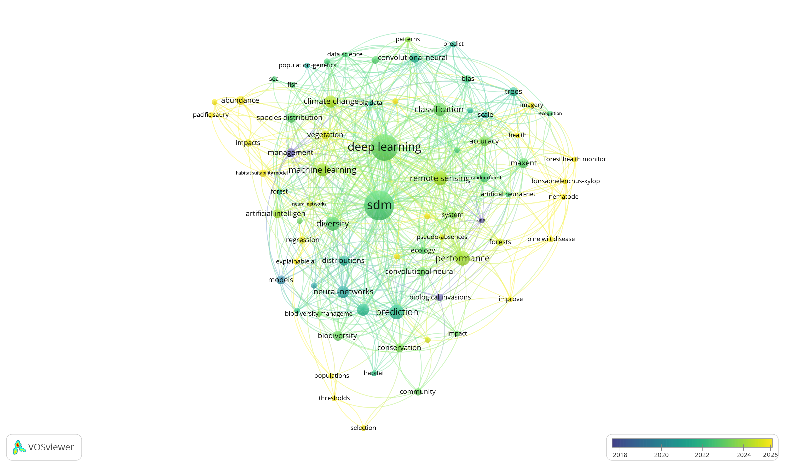


